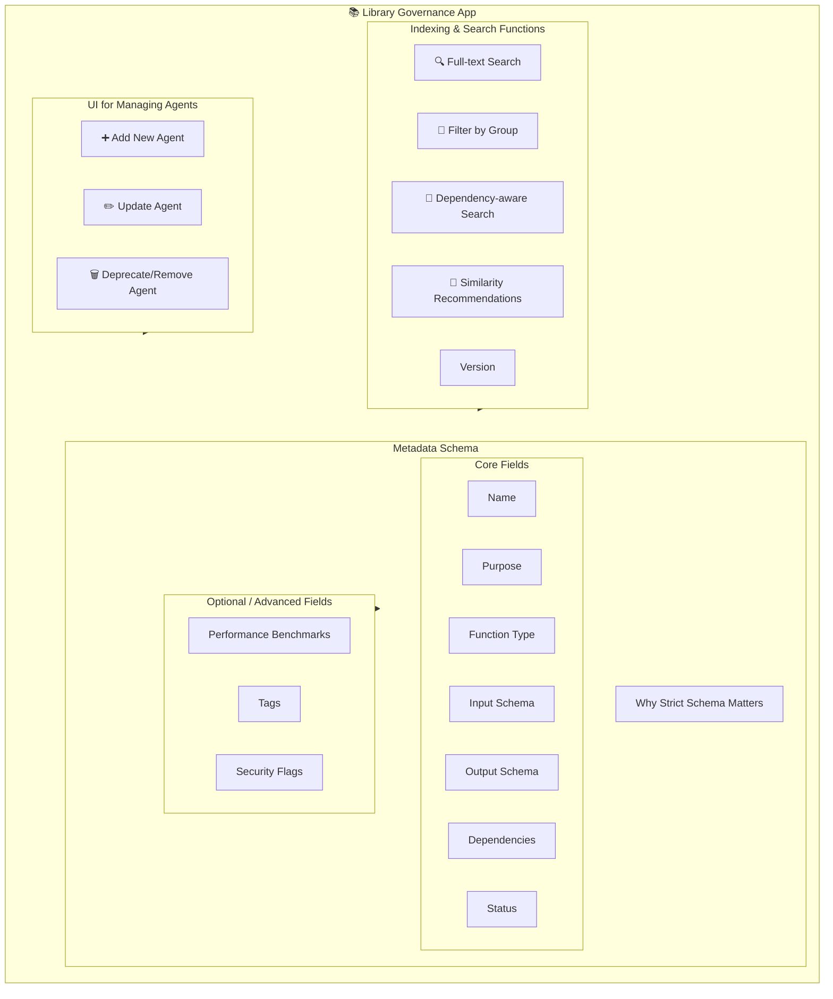

# Agentic Framework

## 📖 Planned Document Workflow — Table of Contents

> **Note:** **AgentOS** refers to [genai-agentos](https://github.com/genai-works-org/genai-agentos) by GenAI Works.

<details>
<summary>Phase 1 — Explaining the Agentic AI World Diagram</summary>

- [Interpret the diagram.](###1.1-interpret-the-diagram)  
- [Clarify AgentOS, Agentic AI, and Agent Library.](###1.2-clarify-agentos-agentic-ai-and-agent-library)  
- [Explain communication mechanisms.](###1.3-explain-communication-mechanisms)  

</details>

<details>
<summary>Phase 2 — Agent Library Architecture & Maintenance Application</summary>

- [Design philosophy.](#design-philosophy)  
- [Grouping by function/role.](#grouping-by-function-role)  
- [Governance app (UI, indexing, metadata).](#governance-app-ui-indexing-metadata)  
- [Best practices.](#best-practices)  

</details>

<details>
<summary>Phase 3 — Standard Structure of Agentic AI</summary>

- [Universal schema.](#universal-schema)  
- [Behavior modes.](#behavior-modes)  
- [Communication standards.](#communication-standards)  
- [Adaptability and inter-agent communication.](#adaptability-and-inter-agent-communication)  

</details>

<details>
<summary>Phase 4 — MRDs Integration</summary>

- [Revisit FlowVoice, FlowSense, AgentMind Map.](#revisit-flowvoice-flowsense-agentmind-map)  
- [Align with standards and library.](#align-with-standards-and-library)  
- [Examples (Mind Map, FlowSense, FlowVoice).](#examples-mind-map-flowsense-flowvoice)  

</details>

<details>
<summary>Phase 5 — Future Enhancements</summary>

- [Cross-VM orchestration.](#cross-vm-orchestration)  
- [Self-maintenance.](#self-maintenance)  
- [Auto-deployment & scaling.](#auto-deployment--scaling)  

</details>

---

## Phase 1 — Explaining the Agentic AI World Diagram

*The "Agentic AI World" represents a conceptual ecosystem where autonomous agents, orchestrated by [AgentOS](https://github.com/genai-works-org/genai-agentos), interact through standardized structures and shared libraries. This world balances imagination with technical rigor — serving both as a blueprint and a vision for scalable agent-driven systems.*  

---

### 1.1 Interpreting the Diagram

The Agentic AI World diagram illustrates a conceptual model for deploying, managing, and scaling autonomous AI agents within a standardized operating system framework. At its core, the diagram emphasizes three interdependent components:

1. **AgentOS (Orchestrator, VM Level)**  
   - Represents the overarching orchestration layer.  
   - Runs on a Virtual Machine (VM), which simplifies deployment, portability, and maintenance compared to container orchestration systems such as Kubernetes.  
   - Provides a unified environment where multiple agents can be deployed, monitored, and coordinated.  
   - Ensures inter-VM communication either through API calls or synchronous/asynchronous database interactions.  

2. **Agentic AI Instances (Docker Containers per Function)**  
   - Each agent runs in its own containerized environment (e.g., Docker), encapsulating a single function or role.  
   - Standard features of an agent include:  
     - *Within Pipeline*: ability to function as a sequential step.  
     - *Event-Driven or Reactor*: respond to triggers or system signals.  
     - *Fully Autonomous*: operate independently once configured.  
   - Agents communicate via JSON-based input/output files and APIs, ensuring interoperability and standardization.  
   - In larger setups, one agent may act as a database or file monitor, responsible for storing or validating outputs.  

3. **Agent Library (Centralized Repository)**  
   - Functions as the catalog of all agent definitions.  
   - Contains structured metadata (purpose, capabilities, roles, input/output formats).  
   - Designed to be scalable and self-descriptive, allowing newly added agents to be recognized immediately.  
   - Provides discoverability so the Agentic AI can browse, identify, and load the required agent for a given task.  

---

**📊 CONCEPTUAL INSIGHT**

The diagram highlights a balance between **standardization** and **modularity**:  
- **Standardization** comes from the agent structure (communication protocols, data exchange format).  
- **Modularity** comes from separating roles into containers and referencing them via a shared library.  

This separation ensures that:  
- Each agent is replaceable and reusable.  
- The library serves as the source of truth for agent knowledge.  
- The VM-based AgentOS acts as the stable execution substrate for diverse system flows.  

---

### 1.2 Clarifying the Core Components

The **Agentic AI World** is built upon three tightly coupled yet distinct components: **AgentOS**, **Agentic AI instances**, and the **Agent Library**. Each serves a specialized role, but together they establish a self-contained ecosystem for orchestrating intelligent workflows.

---

#### 1.2.1 AgentOS (VM Orchestrator Layer)

The **AgentOS** functions as the orchestration environment—the “operating system” for managing agents across a virtualized substrate.  
*(Note: This specifically refers to [genai-agentos](https://github.com/genai-works-org/genai-agentos) by GenAI Works.)*

**Key Characteristics:**
- **VM-Based Deployment**  
  - Encapsulates agents inside a controlled VM environment.  
  - Prioritizes simplicity in deployment and maintainability over more complex container orchestration systems such as Kubernetes.  
- **Coordination Layer**  
  - Responsible for launching, monitoring, and coordinating agent containers.  
  - Facilitates inter-agent and inter-VM communication using standardized APIs.  
- **Communication Hub**  
  - Provides synchronous (real-time) or asynchronous (event/log-driven) communication between agents and databases.  
  - Abstracts away low-level networking, letting developers focus on designing flows.  

💡 **Interpretation Insight:**  
The **AgentOS** is not simply a “server”—it is the operational substrate that ensures agents function cohesively, reliably, and consistently across the enterprise system.

---

#### 1.2.2 Agentic AI (Containerized Intelligence Units)

An **Agentic AI** represents a single-function autonomous unit deployed in its own container (e.g., Docker). Each agent is designed to perform a specific role within a flow.

**Modes of Behavior:**
1. **Pipeline Stage** – Processes structured input and outputs predictable results (e.g., “Summarize text”).  
2. **Event Reactor** – Responds to specific triggers or conditions in real time (e.g., “Send alert if anomalies detected”).  
3. **Fully Autonomous Agent** – Operates independently, capable of decision-making without continual orchestration.  

**Communication Standards:**
- Input/output handled in **JSON format** for interoperability.  
- **API endpoints** define external communication and allow chaining with other agents.  
- Can optionally write to a **central document database** or delegate to another agent responsible for logging.  

**Strengths of this Model:**
- **Scalability** – Multiple agents can be instantiated for the same function.  
- **Isolation** – Each agent runs independently, reducing risk of systemic failure.  
- **Replaceability** – An agent can be swapped with an updated version without disrupting the entire system.  

💡 **Interpretation Insight:**  
The **Agentic AI containers** embody the principle of “function as a service” but enhanced with autonomy, making them versatile building blocks for any role.

---

#### 1.2.3 Agent Library (Centralized Knowledge & Registry)

The **Agent Library** serves as the catalog and knowledge base for all available agents. It ensures discoverability, standardization, and governance of agent functions.

**Structural Principles:**
- **Scalable Index** – Designed so newly added agents are automatically recognized without reconfiguring the system.  
- **Categorized Functions** – Agents grouped by role, capability, or vertical use case (e.g., NLP agents, Planning agents, Monitoring agents).  
- **Self-Descriptive Metadata** – Each agent must carry metadata describing:  
  - *Purpose* (what it is meant to do).  
  - *Inputs & outputs* (data types, expected format).  
  - *Dependencies* (if any).  
  - *Version and authoring details.*  

**Operational Role:**
- The **Agent Library** allows an Agentic AI or the orchestrator to query, identify, and load the right agent for a given task.  
- Supports **browsing, search, and recommendation** so flows can be built dynamically.  
- Lays the groundwork for a **library management application** (to be expanded in Chapter 2).  

💡 **Interpretation Insight:**  
The **Agent Library** is not just storage—it is the semantic backbone that enables agents to be “self-aware” of their role, discoverable, and pluggable into flows.

## 1.3 Communication Mechanisms

The strength of the **Agentic AI World** lies not only in its modular components but also in the standardized communication fabric that ensures interoperability, flexibility, and reliability across agents and orchestrators. Three principal mechanisms enable this exchange: **APIs, JSON-based messaging, and database synchronization.**

---

### 1.3.1 APIs (Application Programming Interfaces)

APIs form the primary conduit for communication between agents, the orchestrator, and external systems.

- **REST/HTTP APIs**  
  - Agents expose endpoints for receiving inputs and delivering outputs.  
  - Promotes stateless communication and ease of integration.  

- **Event-Driven APIs**  
  - Agents can subscribe to or publish events, enabling real-time responsiveness.  
  - Supports scenarios like monitoring, alerts, or task triggers.  

- **Inter-Agent Communication**  
  - Agents interact via APIs rather than direct coupling, ensuring modularity.  
  - This decoupled model allows one agent to be replaced without rewriting the entire system.  

💡 **Insight:** APIs are the *“nervous system”* of Agentic AI—translating intent into actions across distributed components.

---

### 1.3.2 JSON Messaging Standard

JSON serves as the universal lingua franca for data exchange. By enforcing a consistent input/output schema, agents achieve seamless integration regardless of their internal logic or programming language.

- **Input/Output Contracts**  
  - Each agent processes structured JSON that defines the expected fields, types, and formats.  
  - Ensures predictable chaining between agents.  

- **Extensibility**  
  - Metadata (timestamps, version tags, error codes) can be embedded within JSON objects.  
  - Facilitates debugging and auditing.  

- **Agent Autonomy**  
  - By adhering to a JSON contract, an agent can be reused in multiple flows without modification.  

💡 **Insight:** JSON is not just a file format—it is the contractual glue that guarantees interoperability across a heterogeneous agent ecosystem.

---

### 1.3.3 Database Synchronization (Synchronous & Asynchronous)

For larger and more persistent workflows, databases serve as shared memory and coordination hubs.

- **Synchronous Storage**  
  - Agents write results directly to a shared document database.  
  - Useful for maintaining system-wide consistency when immediate access to updated records is required.  

- **Asynchronous Logging**  
  - Agents append results or logs to a database, where downstream agents can fetch them later.  
  - Ideal for event-driven or batch workflows, reducing bottlenecks.  

- **Agent-as-Database-Manager**  
  - A specialized agent may take responsibility for monitoring and validating records, ensuring data integrity and lifecycle compliance.  

💡 **Insight:** Database synchronization ensures that flows can scale beyond ephemeral transactions, evolving into stateful systems capable of maintaining long-term operational memory.

---

### 📊 Integrated View of Communication
<pre>
```mermaid
 flowchart TD

    A[AgentOS (VM Orchestrator)] 
    A -->|API Calls| B[Agentic AI Containers]
    A -->|API Calls| C[Agent Library]
    B -->|API Calls| C[Agent Library]

    B <-->|JSON Messaging| B

    B -->|Sync / Async Writes| D[Shared Database]
    D -->|External APIs| E[Other VMs / Systems] 
```
</pre>

---

### Deployment Note

While **Kubernetes** is a widely used orchestration platform, the current design leverages **GenAI AgentOS** on **VM-based environments** for accessibility and simplicity.  

This choice does not preclude future **Kubernetes adoption** if scaling requires it.

---

## 📖 Phase 2 — Agent Library Architecture & Maintenance Application

*This chapter focuses on the **conceptual and structural design** of the Agent Library.  
The **technical specifications**—such as JSON/YAML schemas for agent definitions, coding conventions, and API standards—are provided in the **Annexes** as reference materials for implementation.*

---

### 2.1 Design Philosophy
The **Agent Library** is the semantic backbone of the *Agentic AI World*.  
Its purpose extends beyond storing agent definitions—it ensures that agents are discoverable, interoperable, and composable within any flow.  

The design philosophy rests on three principles: **scalability, modularity, and auto-recognition**.

---

### 1. Scalable
- The library must grow seamlessly as the number of agents expands from dozens to thousands.  
- Each agent definition is lightweight, stored in structured formats (e.g., JSON/YAML).  
- Indexing and metadata tagging ensure that even at scale, agents remain searchable in real-time.  
- Scalability is not only about quantity—it also covers versioning, allowing multiple iterations of the same agent to coexist without conflict.  

💡 **Analogy:** Just like a digital app store, the library should handle thousands of “apps” (agents) without losing performance or clarity.  

---

### 2. Modular
- Each agent is self-contained—defined by its role, inputs, outputs, and dependencies.  
- Agents are grouped into categories (e.g., NLP, Planning, Data I/O, Diagnostics) but can be recombined flexibly across flows.  
- Modularity ensures reusability: the same summarization agent can work in a research flow, customer service flow, or monitoring system.  
- Dependencies between agents are explicit, preventing “hidden couplings” that reduce reliability.  

💡 **Analogy:** Think of the library as a box of LEGO bricks—each piece is modular, but the combinations are limitless.  

---

### 3. Auto-Recognizable
- Newly introduced agents should be automatically recognized by the library without requiring manual registration.  
- Recognition is enabled through self-descriptive metadata, such as:  
  - Agent name and purpose  
  - Input/output schemas  
  - Supported communication methods (API, event-driven, DB sync)  
  - Role category (pipeline step, reactor, or autonomous)  
- Auto-recognition enables plug-and-play scalability—the system adapts as soon as a new agent is added.  

💡 **Analogy:** Like plugging in a USB drive, the agent should be ready to use immediately once placed in the library.  

---

✅ With this philosophy, the **Agent Library** is not just a storage system, but a **living ecosystem** that scales, evolves, and adapts without human bottlenecks.  

### 2.2 How Agents Are Grouped

The **Agent Library** uses a **layered grouping system** to ensure clarity, reuse, and composability.  
Instead of mixing all properties together, we separate what belongs to the agent itself from what is determined by the **Agentic AI runtime** and the **flow orchestration**.

---

#### 1. Agent-Level: Grouping by Function  

Function is intrinsic to the agent. It describes what the agent does at its core.

- **Data Processing Agents** → Transform or clean inputs without altering meaning.  
  _(e.g., parsers, formatters, converters)_  
- **Knowledge Agents** → Analyze inputs and generate new data or insights.  
  _(e.g., summarizers, translators, fact-checkers)_  
- **Decision Agents** → Output choices or instructions based on inputs.  
  _(e.g., flow optimizer, planner)_  
- **Action Agents** → Perform or execute commands directly.  
  _(e.g., API caller, database writer)_  
- **Monitoring Agents** → Continuously observe and report system or environmental states.  
  _(e.g., health checker, watchdog)_  

💡 *This grouping belongs inside the Agent Library as metadata tags.*

---

#### 2. Runtime-Level: Grouping by Capability  

Capabilities describe how the **Agentic AI runtime** executes the agent, not the agent code itself.

- **Basic** → Runs a single operation per invocation.  
- **Composite** → Chains multiple internal sub-steps before returning output.  
- **Adaptive** → Adjusts behavior based on input context (enabled by runtime providing memory/context).  
- **Autonomous** → Runs continuously or self-triggers actions without external flow control.  

💡 *This is determined by how the AgentOS containerizes and augments the agent, not by the agent’s source code.*

---

#### 3. Flow-Level: Grouping by Role  

Roles describe how the agent is positioned in a workflow. This is assigned during flow design, not coded into the agent.

- **Pipeline Step** → Executes sequentially in a defined order.  
- **Reactor (Event-Driven)** → Responds when a trigger/event occurs.  
- **Orchestrator Helper** → Validates, routes, or adapts data between agents.  
- **Standalone** → Runs independently for monitoring, background tasks, or scheduled jobs.  

💡 *This is managed by the Flow Builder and AgentOS during orchestration, not the agent itself.*

---

**📊 INTEGRATED PERSPECTIVE** 

- **Function** → Defined in the agent (*what it does*).  
- **Capability** → Applied by the runtime (*how it runs*).  
- **Role** → Assigned in the flow (*where it fits*).  

This **separation of concerns** keeps agents lightweight and reusable, while allowing the AgentOS and flows to adapt their behavior dynamically.

---

✅ With this refinement, the **Agent Library** avoids redundancy, provides a clear classification, and aligns with how actual implementation would work.

### 2.3 Library Governance App

The **Library Governance App** serves as the dedicated interface for managing the Agent Library.  
It ensures that agents remain consistent, discoverable, and version-controlled, while also making it easy for developers or administrators to add, update, and maintain them without manual configuration errors.

---

#### 1. UI for Managing Agents (Add / Update / Remove)

The governance app provides a clean, browser-based interface (**client-side HTML/JS/CSS**) with the following features:

- **Add New Agent**
  - Guided form with fields for agent name, purpose, input schema, output schema, dependencies.  
  - Option to upload code snippets or YAML/JSON definition files.  
  - Automatic validation to ensure metadata completeness.  

- **Update Existing Agent**  
  - Editable metadata (e.g., changing supported languages for a Translator agent).  
  - Versioning system prompts user to increment major/minor version numbers.  
  - Dependency check to ensure updates don’t break existing flows.  

- **Remove / Deprecate Agent**  
  - Agents are never *hard deleted* — they are deprecated with a status flag.  
  - Old flows can still reference deprecated agents, but new flows get warnings to avoid them.  

💡 *Analogy: Think of this UI as a package manager (like npm or pip) but visually designed for agent definitions.*

---

#### 2. Indexing and Search Functions

To keep the library usable at scale, **indexing and smart search functions** are core.

- **Full-text search** → search by agent name, description, or tags.  
- **Filter by groupings** → function type (Data Processing, Knowledge, etc.), capability, or role.  
- **Dependency-aware search** → find agents that can accept the output of another agent.  
- **Similarity recommendations** → “agents like this” for alternative options.  
- **Version awareness** → filters that distinguish active, deprecated, or legacy agents.  

💡 *This ensures developers don’t waste time reinventing agents — they can quickly discover what’s already in the library.*

---

#### 3. Metadata Schema

Each agent must follow a **standard metadata schema** that makes it self-descriptive and auto-recognizable by the **AgentOS**.

**Core Fields**
- **Name** → Human-readable identifier.  
- **Purpose** → Short description of what the agent does.  
- **Function Type** → Classification (Data Processing, Knowledge, etc.).  
- **Input Schema** → JSON schema of required input fields.  
- **Output Schema** → JSON schema of expected output.  
- **Dependencies** → Other agents or libraries required.  
- **Version** → Follows semantic versioning (major.minor.patch).  
- **Status** → Active / Deprecated / Experimental.  

**Optional / Advanced Fields**
- **Performance Benchmarks** → e.g., average runtime, memory usage.  
- **Tags** → Freeform categories (e.g., “multilingual”, “low-latency”).  
- **Security Flags** → Notes on data sensitivity or safe usage.  

**Why Strict Schema Matters**

A consistent metadata structure ensures plug-and-play compatibility across the Agent Library:  
- Agents can be automatically validated before entering the library.  
- Flows can be generated and debugged faster, since inputs/outputs are predictable.  
- The AgentOS can match and chain agents seamlessly without manual adjustments.  

💡 *Analogy: Metadata is like a nutrition label for agents — standardized, easy to read, and ensures no surprises.*

---

#### 🔑 Clarification on API Details
- The Agent Library metadata is **descriptive only** (purpose, I/O, dependencies).  
- **API details** (endpoints, auth, communication protocols) belong to the **Agentic AI container** that implements the agent.  
- **AgentOS orchestrates** these API conversations across agents.  

👉 *This separation ensures that the Library stays universal and portable, while Agentic AI containers handle runtime-specific details.*

<pre>

</pre>

---

### 2.4 Best Practices: Version Control, Lifecycle Management, Security

The Agent Library is only as reliable as the practices that govern it. To ensure long-term stability, scalability, and trustworthiness, three pillars are emphasized: **version control, lifecycle management, and security.**

---

#### 1. Version Control
- **Semantic Versioning (semver)** → Agents follow `major.minor.patch` convention.  
  - **Major** → Breaking changes (e.g., input/output schema modified).  
  - **Minor** → Backward-compatible enhancements (e.g., new supported languages).  
  - **Patch** → Bug fixes or performance improvements.  
- **Immutable History** → Old versions remain available for reproducibility.  
- **Deprecation Warnings** → Developers are alerted when flows reference outdated agents.  

💡 *Analogy: Like software packages (npm, pip), versioning keeps agent evolution safe and predictable.*

---

#### 2. Lifecycle Management
- **States**:  
  - **Active** → Currently supported and recommended for use.  
  - **Experimental** → In testing; may lack full guarantees.  
  - **Deprecated** → Retained for backward compatibility but discouraged in new flows.  
- **Update Policy**:  
  - Updates must trigger dependency validation to prevent breaking flows.  
  - Automated tests confirm agent compatibility before status changes.  
- **Archival**:  
  - Deprecated agents eventually move to archived state but remain queryable in the library for audit trails.  

💡 *Analogy: Like a library book lifecycle: new books arrive, old ones move to storage, but nothing is lost.*

---

#### 3. Security
- **Metadata Security Flags** → Identify agents that handle sensitive or restricted data.  
- **Agent Validation** → Agents are scanned for malicious code or misconfigurations before entry.  
- **Execution Sandbox** → Each agent runs in isolated Agentic AI containers to prevent cross-agent interference.  
- **Access Control** → Governance app enforces role-based permissions (e.g., only admins can deprecate or archive agents).  

💡 *Analogy: Like airport security checks, every agent must pass a safety inspection before being cleared for use.*

---

✅ With these best practices in place, the **Agent Library** becomes a resilient and trustworthy foundation, supporting innovation while preventing chaos as the ecosystem scales.

---

