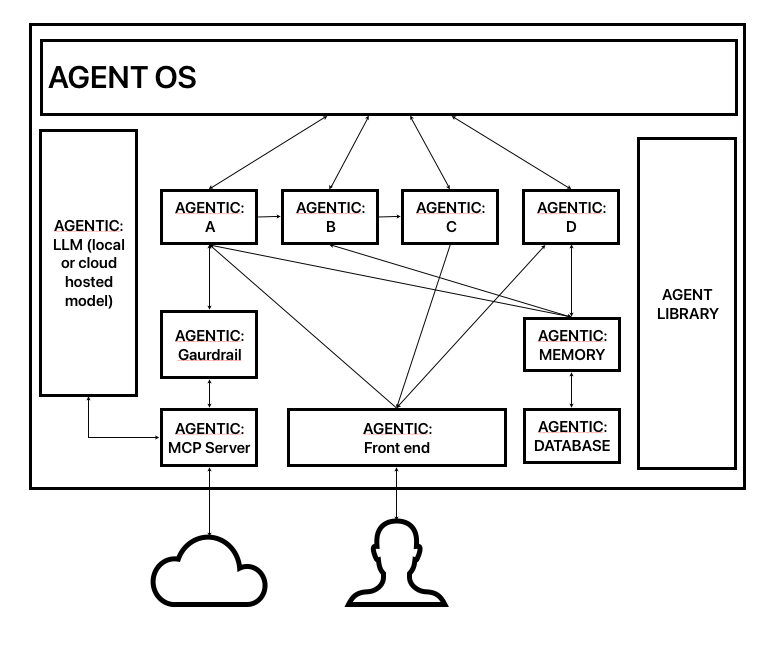
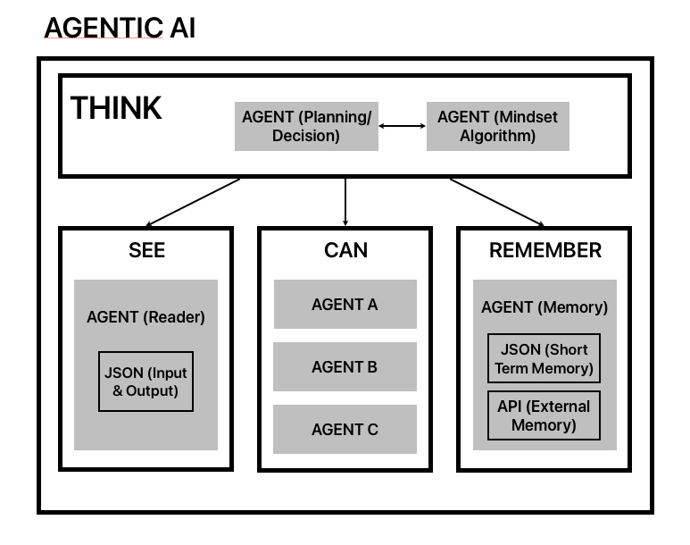

# Agentic World
Version 1.0
*This document is prepared with ChatGPT as AI-Co Assistant*

## 📖 Table of Contents

Phase 1 — Explaining the Agentic AI World Diagram

- [1.1 Interpreting the Diagram.](#11-interpreting-the-diagram)  
- [1.2 Clarifying the Core Components.](#12-clarifying-the-core-components)  
- [1.3 Communication Mechanisms.](#13-communication-mechanisms)  

Phase 2 — Agent Library Architecture

- [2.1 Design Philosophy.](#21-design-philosophy)  
- [2.2 How Agents Are Grouped.](#22-how-agents-are-grouped)  
- [2.3 Library Governance App.](#23-library-governance-app)  
- [2.4 Best Practices: Version Control, Lifecycle Management, Security.](#24-best-practices-version-control-lifecycle-management-security)  

Phase 3 — Standard Structure of Agentic AI

- [3.1 Universal Agent Schema.](#31-universal-agent-schema)  
- [3.2 Standard Internal Structure of Agentic AI (with Cognitive Layers).](#32-standard-internal-structure-of-agentic-ai-(with-cognitive-layers))  
- [3.3 Agent Templates and Reusability.](#33-agent-templates-and-reusability)  
- [3.4 Communication Standards.](#34-communication-standards)  
- [3.5 Adaptability & Role Understanding](#35-adaptability-&-role-understanding)

PHASE 4 — Enhancing AgentOS to Support the Framework

- [4.1 What AgentOS Already Supports.](#41-what-agentOS-already-supports)  
- [4.2 Required Enhancements.](#42-required-enhancements)  
- [4.3 Why These Additions Matter.](#43-why-these-additions-matter)  

---

## Phase 1 — Explaining the Agentic AI World Diagram

*The "Agentic AI World" represents a conceptual ecosystem where autonomous agents, orchestrated by [AgentOS](https://github.com/genai-works-org/genai-agentos), interact through standardized structures and shared libraries. This world balances imagination with technical rigor — serving both as a blueprint and a vision for scalable agent-driven systems.*  
*This concept could be managed setup but aims to make a Conscious Agentic AI System based on the idea of Consciousness Continuum Paper by Samuel J. Cummings, III.*

> **Note:** **AgentOS** refers to [genai-agentos](https://github.com/genai-works-org/genai-agentos) by GenAI Works.

### 1.1 Interpreting the Diagram

The Agentic AI World diagram illustrates a conceptual model for deploying, managing, and scaling autonomous AI agents within a standardized operating system framework. At its core, the diagram emphasizes three interdependent components:

1. **AgentOS (Orchestrator, VM Level)**  
   - Represents the overarching orchestration layer.  
   - Runs on a Virtual Machine (VM), which simplifies deployment, portability, and maintenance.  
   - Provides a unified environment where multiple agents can be deployed, monitored, and coordinated.  
   - Ensures inter-VM communication either through MCP.  

2. **Agentic AI Instances (Docker Containers per Function)**  
   - Each agent/s runs in its own containerized environment (e.g., Docker), encapsulating a function or role.  
   - Standard features of an Agentic AI include ability to function as a sequential step, respond to triggers or system signals, operate independently once configured.  
   - Agents communicate via JSON-based input/output files and APIs, ensuring interoperability and standardization.  
   - In larger setups, one Agentic may act as a database or file monitor, responsible for storing or validating shared outputs of the entire system.  

3. **Agent Library (Centralized Repository)**  
   - Functions as the catalog of all agent definitions.  
   - Contains structured metadata (purpose, capabilities, roles, input/output formats).  
   - Designed to be scalable and self-descriptive, allowing newly added agents to be recognized immediately.  
   - Provides discoverability so the Agentic AI can browse, identify, and load the required agent for a given task.  

**📊 CONCEPTUAL INSIGHT**

The diagram highlights a balance between **standardization** and **modularity**:  
- **Standardization** comes from the agentic structure (communication protocols, data exchange format).  
- **Modularity** comes from separating roles into containers and referencing them via a shared library.  

This separation ensures that:  
- Each agent is replaceable and reusable.  
- The library serves as the source of truth for agent knowledge.  
- The VM-based AgentOS acts as the stable execution substrate for diverse system flows.  

### 📊 Integrated View of Communication

       
### Deployment Note

While **Kubernetes** is a widely used orchestration platform, the current design leverages **GenAI AgentOS** on **VM-based environments** for accessibility and simplicity.  

This choice does not preclude future **Kubernetes adoption** if scaling requires it.

---

## 📖 Phase 2 — Agent Library Architecture

*This chapter focuses on the **conceptual and structural design** of the Agent Library.  
The **technical specifications**—such as JSON/YAML schemas for agent definitions, coding conventions, and API standards—are provided in the **Annexes** as reference materials for implementation.*

### 2.1 Design Philosophy
The **Agent Library** is like the Centralized Knowledge & Registry of the *Agentic AI World*.  
Its purpose extends beyond storing agent definitions—it ensures that agents are discoverable, interoperable, and composable within any flow.  
It is built using **Software 3.0** from the thoughts of *Andrej Karpathy* ([See this video](https://youtu.be/LCEmiRjPEtQ?si=WvlU3Rhz8Z-_4Z3L)) to access the  **Software 2.0** but structured using **Software 1.0**

The design philosophy rests on three principles: **scalability, modularity, and auto-recognition**.

### 1. Scalable
- The library must grow seamlessly as the number of agents expands from dozens to thousands.  
- Each agent definition is lightweight, stored in structured formats (e.g., JSON/YAML).  
- Indexing and metadata tagging ensure that even at scale, agents remain searchable in real-time.  
- Scalability is not only about quantity—it also covers versioning, allowing multiple iterations of the same agent to coexist without conflict.  

### 2. Modular
- Each agent is self-contained—defined by its role, inputs, outputs, and dependencies.  
- Agents are grouped into categories (e.g., NLP, Planning, Data I/O, Diagnostics) but can be recombined flexibly across flows.  
- Modularity ensures reusability: the same summarization agent can work in a research flow, customer service flow, or monitoring system.  
- Dependencies between agents are explicit, preventing “hidden couplings” that reduce reliability.  

### 3. Auto-Recognizable
- Newly introduced agents should be automatically recognized by the library without requiring manual registration.  
- Recognition is enabled through self-descriptive metadata, such as:  
  - Agent name and purpose  
  - Input/output schemas  
  - Supported communication methods (API, event-driven, DB sync)  
  - Role category (pipeline step, reactor, or autonomous)  
- Auto-recognition enables plug-and-play scalability—the system adapts as soon as a new agent is added.  

### 2.2 How Agents Are Grouped

The **Agent Library** uses a **layered grouping system** to ensure clarity, reuse, and composability.  
Instead of mixing all properties together, we separate what belongs to the agent itself from what is determined by the **Agentic AI runtime** and the **flow orchestration**.

#### Grouping by Function  

Function is intrinsic to the agent. It describes what the agent does at its core.

- **Data Processing Agents** → Transform or clean inputs without altering meaning.  
  _(e.g., parsers, formatters, converters)_  
- **Knowledge Agents** → Analyze inputs and generate new data or insights.  
  _(e.g., summarizers, translators, fact-checkers)_  
- **Decision Agents** → Output choices or instructions based on inputs.  
  _(e.g., flow optimizer, planner)_  
- **Action Agents** → Perform or execute commands/instruction directly.  
  _(e.g., API caller, database writer)_
  Two Types:
  1. **Client-Facing Action Agents**
     - Directly interact with external users, applications, or interfaces.
     - Examples: UI trigger agent, chatbot API responder, notification sender.
     - These feel like front-end executors.
  2. **System-Facing Action Agents**
     - Perform operations inside the system, databases, or infra.
     - Examples: database writer, file handler, API caller to internal service.
     - These feel like backend executors.
- **Monitoring Agents** → Continuously observe and report system or environmental states.  
  _(e.g., health checker, watchdog)_  

💡 *This grouping belongs inside the Agent Library as metadata tags.*

**📊 INTEGRATED PERSPECTIVE** 

- **Function** → Defined in the agent (*what it does*).  
- **Capability** → Applied by the runtime (*how it runs*).  
- **Role** → Assigned in the flow (*where it fits*).  

### 2.3 Library Governance App

The **Library Governance App** serves as the dedicated interface for managing the Agent Library.  
It ensures that agents remain consistent, discoverable, and version-controlled, while also making it easy for developers or administrators to add, update, and maintain them without manual configuration errors.

📌 **Implementation Note**
While this framework defines the need for governance mechanisms, the actual design and deployment of governance applications (UI, workflows, integration) will be detailed in a separate Implementation Guide. This ensures the framework remains timeless and principle-driven, while practical tooling can evolve with technology.

#### 1. UI for Managing Agents (Add / Update / Remove)

The governance app provides a clean, browser-based interface (**client-side HTML/JS/CSS**) with the following features:

- **Add New Agent**
  - For simplicity and beter user experience, it uses *System 3.0* where user just input prompt to generate the needed Agent. At the background, the implementation is guided with *System 1.0* to meet the standard fields for uniformity which may include agent name, purpose, input schema, output schema, dependencies. The flow will also ensure to avoid duplication of Agent or advise appropriate function or role.
  - Option to upload code snippets, "YAML/JSON definition files, or existing agents from other platform such us n8n, Make, CrewAI, or etc.
  - Automatic validation to ensure metadata completeness.  

- **Update Existing Agent**  
  - Editable metadata (e.g., changing supported languages for a Translator agent).  
  - Versioning system prompts user to increment major/minor version numbers.  
  - Dependency check to ensure updates don’t break existing flows.  

- **Remove / Deprecate Agent**  
  - Agents are never *hard deleted* — they are deprecated with a status flag.  
  - Old flows can still reference deprecated agents, but new flows get warnings to avoid them.  

#### 2. Indexing and Search Functions

To keep the library usable at scale, **indexing and smart search functions** are core.

- **Full-text search** → search by agent name, description, or tags.  
- **Filter by groupings** → function type (Data Processing, Knowledge, etc.), capability, or role.  
- **Dependency-aware search** → find agents that can accept the output of another agent.  
- **Similarity recommendations** → “agents like this” for alternative options.  
- **Version awareness** → filters that distinguish active, deprecated, or legacy agents.  

#### 3. Metadata Schema

Each agent must follow a **standard metadata schema** that makes it self-descriptive and auto-recognizable by the **AgentOS**.

**Core Fields**
- **Name** → Human-readable identifier.  
- **Purpose** → Short description of what the agent does.  
- **Function Type** → Classification (Data Processing, Knowledge, etc.).  
- **Input/Output Schema** → JSON schema of required input fields and expected output.  
- **Dependencies** → Other agents or libraries required.  
- **Version** → Follows semantic versioning (major.minor.patch).  
- **Status** → Active / Deprecated / Experimental.  

**Optional / Advanced Fields**
- **Performance Benchmarks** → e.g., average runtime, memory usage.  
- **Tags** → Freeform categories (e.g., “multilingual”, “low-latency”).  
- **Security Flags** → Notes on data sensitivity or safe usage.  

**Why Strict Schema Matters**
A consistent metadata structure ensures plug-and-play compatibility across the Agent Library:  
- Agents can be automatically validated before entering the library.  
- Flows can be generated and debugged faster, since inputs/outputs are predictable.  
- The AgentOS can match and chain agents seamlessly without manual adjustments.  

### 2.4 Best Practices: Version Control, Lifecycle Management, Security
The Agent Library is only as reliable as the practices that govern it. To ensure long-term stability, scalability, and trustworthiness, three pillars are emphasized: **version control, lifecycle management, and security.**

#### 1. Version Control
- **Semantic Versioning (semver)** → Agents follow `major.minor.patch` convention.  
  - **Major** → Breaking changes (e.g., input/output schema modified).  
  - **Minor** → Backward-compatible enhancements (e.g., new supported languages).  
  - **Patch** → Bug fixes or performance improvements.  
- **Immutable History** → Old versions remain available for reproducibility.  
- **Deprecation Warnings** → Developers are alerted when flows reference outdated agents.  

#### 2. Lifecycle Management
- **States**:  
  - **Active** → Currently supported and recommended for use.  
  - **Experimental** → In testing; may lack full guarantees.  
  - **Deprecated** → Retained for backward compatibility but discouraged in new flows.  
- **Update Policy**:  
  - Updates must trigger dependency validation to prevent breaking flows.  
  - Automated tests confirm agent compatibility before status changes.  
- **Archival**:  
  - Deprecated agents eventually move to archived state but remain queryable in the library for audit trails.  

#### 3. Security
- **Metadata Security Flags** → Identify agents that handle sensitive or restricted data.  
- **Agent Validation** → Agents are scanned for malicious code or misconfigurations before entry.  
- **Execution Sandbox** → Each agent runs in isolated Agentic AI containers to prevent cross-agent interference.  
- **Access Control** → Governance app enforces role-based permissions (e.g., only admins can deprecate or archive agents).  

---

## 📖 Phase 3 — Standard Structure of Agentic AI

### 3.1 Universal Agent Schema
The **Universal Agent Schema** defines the minimum contract every Agentic AI must follow to ensure interoperability inside the GenAI AgentOS. By enforcing consistent input/output handling, event awareness, and autonomous triggers, any agent can be seamlessly integrated, reused, and orchestrated without custom wiring.

#### Core Principles

1. **Input/Output Handling**  
   - Every agent must declare its expected input schema (e.g., JSON fields, data types, constraints).  
   - Every agent must define its output schema with clear guarantees on structure and type.  
   - This ensures upstream and downstream agents know what to expect, making flows resilient.  

2. **Event Responsiveness**  
   - Agents must accept events as triggers, not just static inputs.  
   - Events can be:  
     - **System Events** (e.g., flow started, timer fired).  
     - **Agent Events** (e.g., another agent’s output becomes available).  
     - **External Events** (e.g., webhook, user input).  
   - Event-driven capability ensures agents can be reactive, not only sequential.  

3. **Autonomous Triggers**  
   - Certain agents may self-initiate tasks (e.g., monitoring or watchdog agents).  
   - Autonomous mode is standardized so that AgentOS can throttle, pause, or resume them safely.  

#### JSON Schema as the Backbone
All agent definitions rely on **JSON Schema** as the universal format:

- **Input Schema** → Guarantees the required fields.  
- **Output Schema** → Defines what downstream agents can trust.  
- **Events** → Lists what this agent can respond to.  
- **Autonomous Flag** → Clarifies if the agent can self-run without external invocation.  

#### Plug-and-Play Compatibility
Because every agent follows this schema:

- Agents can be swapped or updated without breaking flows.  
- Flows can be auto-validated by AgentOS (input/output mismatches flagged instantly).  
- The Agent Library can auto-generate documentation and visual previews from metadata.  

### 3.2 Standard Internal Structure of Agentic AI (with Cognitive Layers)

Each Agentic AI follows a cognitive-inspired architecture that ensures it can perceive inputs, execute tasks, remember context, and understand its role.

**Deployment Model:**
- The AgentOS can launch new Agentic AI instances when needed.
- Agents can be manually added by users in early-stage setups.
- In advanced configurations, the AgentOS (or another Agentic AI) can automatically deploy new Agentic AIs and fetch required agent templates from the Agent Library.

**Cognitive Layer Framework** *(inspired from the idea of Prof Tom Yeh of GenAI.works. This part could also adapt the idea of Cobalt Mind by Louis Janssens of H.AI.D.&I.)*

1. **THINK → Role & Behavior Layer**
- Defines the purpose, role, and runtime behavior mode of the agent.
- Reads its metadata from the Agent Library to know what it is supposed to do.
- Determines execution style: Basic, Composite, Adaptive, or Autonomous.
- This by default used agents that access the “LLM” to decide. It will have a default mindset(algorithm of how it will think to be discuss in Annex) that could be improve overtime in further update.
- It will detect “SEE” to understand the input or review/managed output while considering “REMEMBER” additional input before it will trigger the “CAN” to perform the needed action using the agents.

2. **SEE → Input/Output & Perception Layer**
- Captures inputs and review/managed output according to the JSON schema.
- Handles different data modalities (text, API call, file, sensor, etc.).
- Ensures input validation and normalization before execution.
- JSON that handles the input was able to receive the information from AgentOS or other Agent either within a pipeline or from other autonomous Agent which includes monitoring Agent.

3.	**CAN → Action & Execution Layer**
- Executes the core task logic of the agent.
- May call other internal agents or sub-modules to complete a task.
- Produces output aligned with its declared schema.

4.	**REMEMBER → Memory & Context Layer**
- Stores short-term memory inside the agent (local JSON cache).
- Can call a Memory Agent that access shared or long-term state.
- Enables adaptive/autonomous behavior by providing past context.

**LLM***
- Default Availability: The Agentic AI assumes all agents can access the “LLM” if needed, but lightweight agents may bypass it.
- In Agentic World, LLM is a separate Agentic AI which could be self hosted within the AgentOS but could also consider to access LLM Provider with more advance capability such as OpenAI

**Communication & Guardrails**
- Inside the System (Internal Agent-to-Agent or DB calls): Direct, schema-validated communication — no guardrail needed.
- Outside the System (cross-VM, or external APIs):
  - All interactions pass through the Guardrail Agent, ensuring compliance, security, and safe operation except between user to Frontend Agentic AI communication.

### 3.3 Agentic AI Templates and Reusability
To avoid reinventing the wheel for every workflow, **Agentic AI Templates** provide a standardized starting point for common agentic AI patterns. Templates accelerate development, encourage best practices, and ensure structural consistency across the ecosystem.

#### Default Templates
The system provides a core set of predefined Agentic AI templates representing recurring roles:

- **Data Transformer** → Cleans, normalizes, or enriches input data (e.g., convert CSV to JSON, text cleaning).  
- **Knowledge Retriever** → Fetches knowledge from databases, APIs, or vector stores.  
- **Planner + Executor** → Breaks down goals into steps and performs actions sequentially.  
- **Monitor/Observer** → Watches streams, logs, or signals and raises events.  
- **Decision Maker** → Evaluates conditions and outputs recommended choices.  

💡 *These templates act like starter kits — developers only need to fill in specifics (e.g., input schema, data source) while the base behavior is predefined.*

#### Custom Templates

- Any composite agent that emerges during orchestration can be saved as a reusable template.  
- Developers can:  
  - Export templates to JSON/YAML.  
  - Version them using semantic versioning.  
  - Share across teams or publish to the Agent Library.  

**Example:** A custom “Translation + Summarization” agent can be packaged as one unit for reuse in multiple projects.

#### Versioning & Sharing

- Templates are version-controlled (e.g., `1.0.0 → 1.1.0`).  
- Shared via:  
  - **Agent Library** (global repository).  
  - **Local/Team Registries** (internal use cases).  

- Templates can be extended:  
  - Add new agent for a new capabilities.  
  - Adjust I/O schemas while maintaining backward compatibility.  

#### Agentic AI Governance App

To prevent template sprawl and ensure consistent quality, a dedicated **Agentic Governance App** mirrors the role of the Agent Library Governance App:

*For simplicity and better user experience, the app still used System 3.0 or used prompt as client facing tool to access System 2.0 (LLM) capability in building the Agentic AI - but in the background, it will use System 1.0 to structure the flow which includes ensuring the needed metadata is provided to have better and more accurate output.*

- **UI Management**: Add, update, deprecate, or remove templates.  
- **Indexing & Search**: Browse templates by role (e.g., transformer, retriever) or by metadata (purpose, version, tags).  
- **Metadata Schema for Templates**:  
  - **Template Name** → Human-readable identifier.  
  - **Purpose** → What workflow pattern it supports.  
  - **Base Agents Used** → Dependencies included.  
  - **Input/Output Schema** → JSON schema inherited or customized.  
  - **Version** → Follows semantic versioning.  
  - **Status** → Active / Deprecated / Experimental.  
  - **Sharing & Access Control** → Manage which teams can publish, fork, or extend templates.  
  - **Audit Logs** → Track usage across projects (e.g., *“Template X is used in 7 flows”*).

### 3.4 Communication Standards  

For Agentic AI to remain interoperable and modular, all communication must adhere to strict standards. These ensure that agents from different teams, versions, or contexts can still connect seamlessly through AgentOS.  

#### 3.4.1 JSON as the Universal Data Format  
- All inputs/outputs between agentic AI are serialized as **JSON**.  
- JSON is lightweight, human-readable, and compatible with most programming languages.   
- This guarantees plug-and-play compatibility — if schemas match, agents can connect.  

#### 3.4.2 Event Logs for Traceability  
- Every agent interaction generates **structured event logs in JSON**.  
- Event logs capture:  
  - Timestamp of execution.  
  - Agent invoked and version.  
  - Inputs/outputs summary.  
  - Errors or anomalies.  
  - Execution duration and resource usage.  

- Logs serve three purposes:  
  1. **Debugging** — tracing why a flow broke.  
  2. **Auditing** — tracking agent decisions (important for governance & compliance).  
  3. **Optimization** — identifying performance bottlenecks.  

### 3.5 Adaptability & Role Understanding

For Agentic AI systems to operate flexibly across diverse tasks, they must not only process inputs but also understand the role they are expected to perform. Role-awareness ensures that both the **AgentOS** (ecosystem-level orchestration) and the **Agentic AI itself** (internal orchestration) can route tasks effectively.

#### Initial State: Manual Role Assignment
- Roles are defined at configuration time by developers or system architects.  
- At the **AgentOS level**:  
  - The Front-End Agentic AI is manually designated for user interaction.  
  - A Planner Agentic AI is configured to decompose goals.  
  - Knowledge or Action Agents are explicitly wired to serve downstream needs.  
- At the **internal Agentic AI level**:  
  - The *Think* layer is configured to route data to the correct sub-agent.  
  - **Example**: If input = PDF → Data Processing agent → Knowledge agent for summarization.  

This ensures reliability but requires human configuration of flows and mappings.

#### Near-Term Vision: Metadata-Driven Role Awareness
- Each agent declares its role in the **Agent Library metadata schema** (e.g., *Knowledge Retriever*, *Decision Maker*, *Data Transformer*).  
- When the **AgentOS** deploys an Agentic AI, it injects these role hints into runtime.  
- The Agentic AI’s **Think component** then uses this metadata to decide:  
  - Which agent should handle the incoming request.  
  - How sub-agents should sequence their actions.  

This step moves responsibility from hard-coded config to schema-driven adaptability.

#### Future State: Autonomous Role Resolution
- **AgentOS and Agentic AIs evolve into a dynamic marketplace of roles**:  
  - Each Agentic AI *submits itself* to AgentOS with metadata on capabilities.  
  - AgentOS matches incoming tasks to the most appropriate role-holder.  
- Within an Agentic AI:  
  - The *Think* layer leverages LLM reasoning + metadata to dynamically assign roles to sub-agents, rather than relying only on static configs.  
- **Benefits**:  
  - **Routing** → Inputs are automatically matched to the right role.  
  - **Orchestration** → New agents can join without reconfiguring the system.  
  - **Autonomy** → Flows adapt to changing contexts with minimal human intervention.  

💡 **Insight**: Today, role assignment is manual and static. Tomorrow, with standardized metadata and runtime reasoning, role-awareness becomes adaptive and autonomous—a step toward self-organizing Agentic ecosystems.

---

## PHASE 4 — Enhancing AgentOS to Support the Framework

In Chapters 1–3, we established the communication model, the Agent Library, and the standard structure of Agentic AI. While GenAI-AgentOS already provides the orchestration backbone, several enhancements are needed to fully support the framework.

### 4.1 What AgentOS Already Supports
- **Agent registration** (agents can join, authenticate, become active/inactive).  
- **Integration of different agent types**:  
  - GenAI Agents (native protocol).  
  - MCP Servers (Model Context Protocol tools).  
  - A2A Servers (agent-to-agent).  
- **Flow orchestration and validation** (ensures compatibility).  
- **Tool discovery** through MCP.  

### 4.2 Required Enhancements

To align with our framework vision, AgentOS needs additional layers:

1. **Structured Agent Library Integration**  
   - Agents discoverable via rich metadata (purpose, schemas, dependencies).  
   - Auto-recognition of agents as “plug-and-play” components.  

2. **Governance Tools**  
   - UI for adding, updating, deprecating agents.  
   - Enforced lifecycle/versioning (active → deprecated → retired).  

3. **Agent Templates Registry**  
   - Save composite agents as reusable templates.  
   - Templates are versioned, shareable, and extendable.  

4. **Cognitive Layer Support**  
   - Support for SEE → CAN → REMEMBER → THINK structure inside Agentic AI.  
   - Runtime ensures agents can handle sensing, acting, memory, and reasoning.  

5. **Behavior Mode Awareness**  
   - Runtime recognizes execution modes:  
     - Basic (single task).  
     - Composite (multi-step).  
     - Adaptive (context-aware).  
     - Autonomous (self-triggered).  

6. **Boundary Guardrails**  
   - Guardrails applied only when communicating outside the ecosystem (e.g., web, email, other VMs).  
   - Internal flows remain unblocked for efficiency.  

7. **Event Logging & Traceability**  
   - Standardized event logs for debugging, auditing, and security.  
   - JSON logs with execution status, timestamps, and agent decisions. 

### 4.3 Why These Additions Matter
- **Consistency** → Every agent follows the same schema.  
- **Scalability** → Templates and governance make large ecosystems manageable.  
- **Security** → Guardrails prevent unsafe external communications.  
- **Transparency** → Logs and metadata ensure trust and traceability.  
- **Adaptability** → Cognitive layers + behavior modes allow agents to evolve.  

✨ *With these enhancements, AgentOS evolves from a simple orchestrator into a full intelligent ecosystem manager—capable of governing agents, reusing knowledge, and enforcing safe scalable operations.*

---

